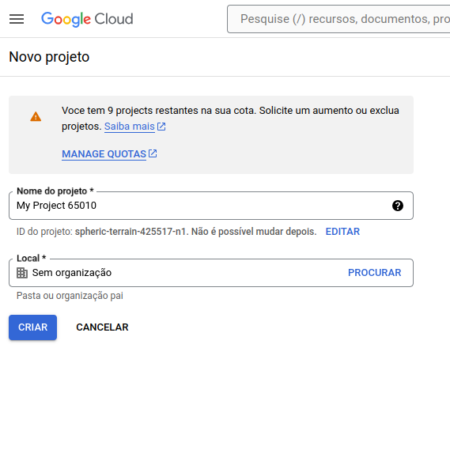
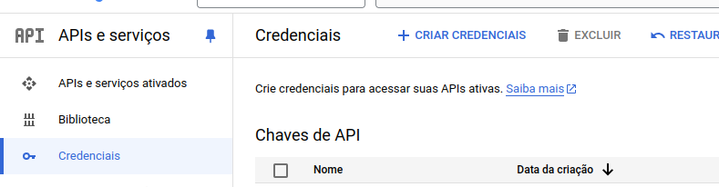

# Assistente de Emails usando LangChain, OpenAI e API Gmail


# Descrição do Projeto 

O seguinte projeto foi implementado com base na documentação do framework Lang Chain com as ferramentas toolkit, sendo utilizando para ajudar no desenvolvimento  de aplicações com os grandes modelos de linguagem. Siga as instruções abaixo para conseguir executar o projeto.


# Crie um App no Google WorkSpace
Para que sua assistente tenha acesso aos emails do gmail é necessário que você crie um aplicativo no google workspace para criar o arquivo credentials.json para sua aplicação ter acesso ao conteúdo do gmail. Além disso, ative dentro do App a API do gmail para usar os recursos.

1. Crie um novo projeto




2. Depois crie as credencias clicando em "Criar Credenciais" dentro do projeto para ter acesso ao arquivo "Credentials.json"



3. Após criar as credenciais faça download do arquivo .json gerado.


# Instalação 

Para clonar este repositório com o projeto execute o seguinte comando abaixo.
```
> git clone https://Roma4160@bitbucket.org/helioasmoura/iot-digital-gemini-dashboard.git

```
Em seguida, crie um ambiente virtual para instalar as dependencias necessárias para executar o projeto.

> pip install -U langchain-community

> pip install google-oauth2-tool

> pip install --upgrade --quiet  google-api-python-client

> pip install --upgrade --quiet  google-auth-oauthlib

> pip install --upgrade --quiet  google-auth-httplib2

> pip install --upgrade --quiet  beautifulsoup4


# Como usar 
Após as intalações realizadas clone este repositório para acesso aos códigos. Além disso, para executar modelos da OpenAI, disponível no LangChain, é essencial que você possua uma chave da OpenAI e configure o arquivo .env.


# Tecnologias Utilizadas 

1. Linguagem Python
2. Google Oauth2
3. Lang Chain
4. Gmail API
5. Google WorkSpace

# Contato
Para dúvidas e sugestões  sobre o projeto, entre em contato através do email: janaina.ribeiro@aluno.uece.br.

# Referências

Lang Chain: 
https://python.langchain.com/v0.1/docs/integrations/toolkits/gmail/

Google WorkSpace: 
https://console.cloud.google.com/welcome?project=plucky-haven-424100-k4
